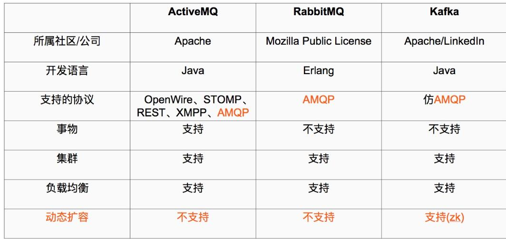

# zookeeper和kafka集群搭建
 - 摘自：https://blog.csdn.net/my_bai/article/details/68490632
## Kafka初识

### Kafka使用背景
在我们大量使用分布式数据库、分布式计算集群的时候，是否会遇到这样的一些问题：

- 我们想分析下用户行为（pageviews），以便我们设计出更好的广告位
- 我想对用户的搜索关键词进行统计，分析出当前的流行趋势
- 有些数据，存储数据库浪费，直接存储硬盘效率又低

这些场景都有一个共同点：
数据是由上游模块产生，上游模块，使用上游模块的数据计算、统计、分析，这个时候就可以使用消息系统，尤其是分布式消息系统！

### Kafka的定义
What is Kafka：它是一个分布式消息系统，由linkedin使用scala编写，用作LinkedIn的活动流（Activity Stream）和运营数据处理管道（Pipeline）的基础。具有高水平扩展和高吞吐量。

### Kafka和其他主流分布式消息系统的对比




## Zookeeper集群搭建
Kafka集群是把状态保存在Zookeeper中的，首先要搭建Zookeeper集群。

### 软件环境
3台服务器-我的测试）
192.168.1.60 server1
192.168.1.62 server2
192.168.1.63 server3
- 1、Linux服务器一台、三台、五台、（2*n+1），Zookeeper集群的工作是超过半数才能对外提供服务，3台中超过两台超过半数，允许1台挂掉 ，是否可以用偶数，其实没必要。
如果有四台那么挂掉一台还剩下三台服务器，如果在挂掉一个就不行了，这里记住是超过半数。
- 2、Java jdk1.8 zookeeper是用java写的所以他的需要JAVA环境，java是运行在java虚拟机上的
- 3、Zookeeper的稳定版本Zookeeper 3.4.6版本

### 配置安装zookeeper环境
首先要注意在生产环境中目录结构要定义好，防止在项目过多的时候找不到所需的项目

```
#首先创建Zookeeper项目目录
mkdir zookeeper #项目目录
mkdir zkdata #存放快照日志
mkdir zkdatalog#存放事物日志
```
### 修改配置文件
进入到解压好的zookeeper的conf目录下,有三个配置文件，configuration.xsl,log4j.properties,zoo_sample.cfg

- zoo_sample.cfg  这个文件是官方给我们的zookeeper的样板文件，用它复制一份命名为zoo.cfg，zoo.cfg是官方指定的文件命名规则，做如下配置

```
tickTime=2000
initLimit=10
syncLimit=5
dataDir=/opt/zookeeper/zkdata
dataLogDir=/opt/zookeeper/zkdatalog
clientPort=12181
server.1=192.168.1.60:12888:13888
server.2=192.168.1.62:12888:13888
server.3=192.168.1.63:12888:13888
#server.1 这个1是服务器的标识也可以是其他的数字， 表示这个是第几号服务器，用来标识服务器，这个标识要写到快照目录下面myid文件里
#192.168.1.60为集群里的IP地址，第一个端口是master和slave之间的通信端口，默认是2888，第二个端口是leader选举的端口，集群刚启动的时候选举或者leader挂掉之后进行新的选举的端口默认是3888
```

 - 配置文件解释

 ```
 #tickTime：
这个时间是作为 Zookeeper 服务器之间或客户端与服务器之间维持心跳的时间间隔，也就是每个 tickTime 时间就会发送一个心跳。
#initLimit：
这个配置项是用来配置 Zookeeper 接受客户端（这里所说的客户端不是用户连接 Zookeeper 服务器的客户端，而是 Zookeeper 服务器集群中连接到 Leader 的 Follower 服务器）初始化连接时最长能忍受多少个心跳时间间隔数。当已经超过 5个心跳的时间（也就是 tickTime）长度后 Zookeeper 服务器还没有收到客户端的返回信息，那么表明这个客户端连接失败。总的时间长度就是 5*2000=10 秒
#syncLimit：
这个配置项标识 Leader 与Follower 之间发送消息，请求和应答时间长度，最长不能超过多少个 tickTime 的时间长度，总的时间长度就是5*2000=10秒
#dataDir：
快照日志的存储路径
#dataLogDir：
事物日志的存储路径，如果不配置这个那么事物日志会默认存储到dataDir制定的目录，这样会严重影响zk的性能，当zk吞吐量较大的时候，产生的事物日志、快照日志太多
#clientPort：
这个端口就是客户端连接 Zookeeper 服务器的端口，Zookeeper 会监听这个端口，接受客户端的访问请求。修改他的端口改大点
 ```

- 创建myid文件

```
#server1
echo "1" > /opt/zookeeper/zkdata/myid
#server2
echo "2" > /opt/zookeeper/zkdata/myid
#server3
echo "3" > /opt/zookeeper/zkdata/myid
```
### 重要配置说明
- 1、myid文件和server.myid  在快照目录下存放的标识本台服务器的文件，他是整个zk集群用来发现彼此的一个重要标识。
- 2、zoo.cfg 文件是zookeeper配置文件 在conf目录里。
- 3、log4j.properties文件是zk的日志输出文件 在conf目录里用java写的程序基本上有个共同点日志都用log4j，来进行管理。
- 4、zkEnv.sh和zkServer.sh文件
  - zkServer.sh 主的管理程序文件
  - zkEnv.sh 是主要配置，zookeeper集群启动时配置环境变量的文件
- 5、还有一个需要注意
  - zooKeeper server will not remove old snapshots and log files when using the default configuration (see autopurge below), this is the responsibility of the operator
  - zookeeper不会主动的清除旧的快照和日志文件，这个是操作者的责任。

### 启动服务并查看
- 启动zookeeper服务

```
#进入到Zookeeper的bin目录下
cd /opt/zookeeper/zookeeper-3.4.6/bin
#启动服务（3台都需要操作）
./zkServer.sh start
```
- 检查服务状态

```
#检查服务器状态
./zkServer.sh status
通过status就能看到状态：

JMX enabled by default
Using config: /opt/zookeeper/zookeeper-3.4.6/bin/../conf/zoo.cfg  #配置文件
Mode: follower  #他是否为领导
```
zk集群一般只有一个leader，多个follower，主一般是相应客户端的读写请求，而从主同步数据，当主挂掉之后就会从follower里投票选举一个leader出来。

## kafka集群搭建

### 软件环境
- 和上述zookeeper一样的三台机器
- 已经搭建好zookeeper集群
- 软件版本kafka_2.11-0.9.0.1.tgz

## 创建目录

```
mkdir kafka #创建项目目录
cd kafka
mkdir kafkalogs #创建kafka消息目录，主要存放kafka消息
```
### 修改配置文件
进入到config目录

```
cd /opt/kafka/kafka_2.11-0.9.0.1/config/
```

- 主要关注：server.properties 这个文件即可，我们可以发现在目录下：
有很多文件，这里可以发现有Zookeeper文件，我们可以根据Kafka内带的zk集群来启动，但是建议使用独立的zk集群
- 修改server.properties配置文件

```
broker.id=0  #当前机器在集群中的唯一标识，和zookeeper的myid性质一样
port=19092 #当前kafka对外提供服务的端口默认是9092
host.name=192.168.1.60 #这个参数默认是关闭的，在0.8.1有个bug，DNS解析问题，失败率的问题。
num.network.threads=3 #这个是borker进行网络处理的线程数
num.io.threads=8 #这个是borker进行I/O处理的线程数
log.dirs=/opt/kafka/kafkalogs/ #消息存放的目录，这个目录可以配置为“，”逗号分割的表达式，上面的num.io.threads要大于这个目录的个数这个目录，如果配置多个目录，新创建的topic他把消息持久化的地方是，当前以逗号分割的目录中，那个分区数最少就放那一个
socket.send.buffer.bytes=102400 #发送缓冲区buffer大小，数据不是一下子就发送的，先回存储到缓冲区了到达一定的大小后在发送，能提高性能
socket.receive.buffer.bytes=102400 #kafka接收缓冲区大小，当数据到达一定大小后在序列化到磁盘
socket.request.max.bytes=104857600 #这个参数是向kafka请求消息或者向kafka发送消息的请请求的最大数，这个值不能超过java的堆栈大小
num.partitions=1 #默认的分区数，一个topic默认1个分区数
log.retention.hours=168 #默认消息的最大持久化时间，168小时，7天
message.max.byte=5242880  #消息保存的最大值5M
default.replication.factor=2  #kafka保存消息的副本数，如果一个副本失效了，另一个还可以继续提供服务
replica.fetch.max.bytes=5242880  #取消息的最大直接数
log.segment.bytes=1073741824 #这个参数是：因为kafka的消息是以追加的形式落地到文件，当超过这个值的时候，kafka会新起一个文件
log.retention.check.interval.ms=300000 #每隔300000毫秒去检查上面配置的log失效时间（log.retention.hours=168 ），到目录查看是否有过期的消息如果有，删除
log.cleaner.enable=false #是否启用log压缩，一般不用启用，启用的话可以提高性能
zookeeper.connect=192.168.1.60:12181,192.168.1.62:12181,192.168.1.63:1218 #设置zookeeper的连接端口

```


### 启动kafka集群并测试

- 启动服务

```
#从后台启动Kafka集群（3台都需要启动）
cd
/opt/kafka/kafka_2.11-0.9.0.1//bin #进入到kafka的bin目录
./kafka-server-start.sh -daemon ../config/server.properties
```

- 检查服务启动成功

```
#执行命令jps
20348 Jps
4233 QuorumPeerMain
18991 Kafka
```

- 创建Topic来验证是否创建成功

```
#创建Topic
./kafka-topics.sh --create --zookeeper 192.168.1.60:12181 --replication-factor 2 --partitions 1 --topic enilu-test
#解释
--replication-factor 2   #复制两份
--partitions 1 #创建1个分区
--topic #主题为shuaige

'''在一台服务器上创建一个发布者'''
#创建一个broker，发布者
./kafka-console-producer.sh --broker-list 192.168.1.60:19092 --topic enilu-test

'''在一台服务器上创建一个订阅者'''
./kafka-console-consumer.sh --zookeeper localhost:12181 --topic enilu-test --from-beginning
```

- 在发布者端命令行输入内容，则在订阅者控制台会输出接收到的消息
